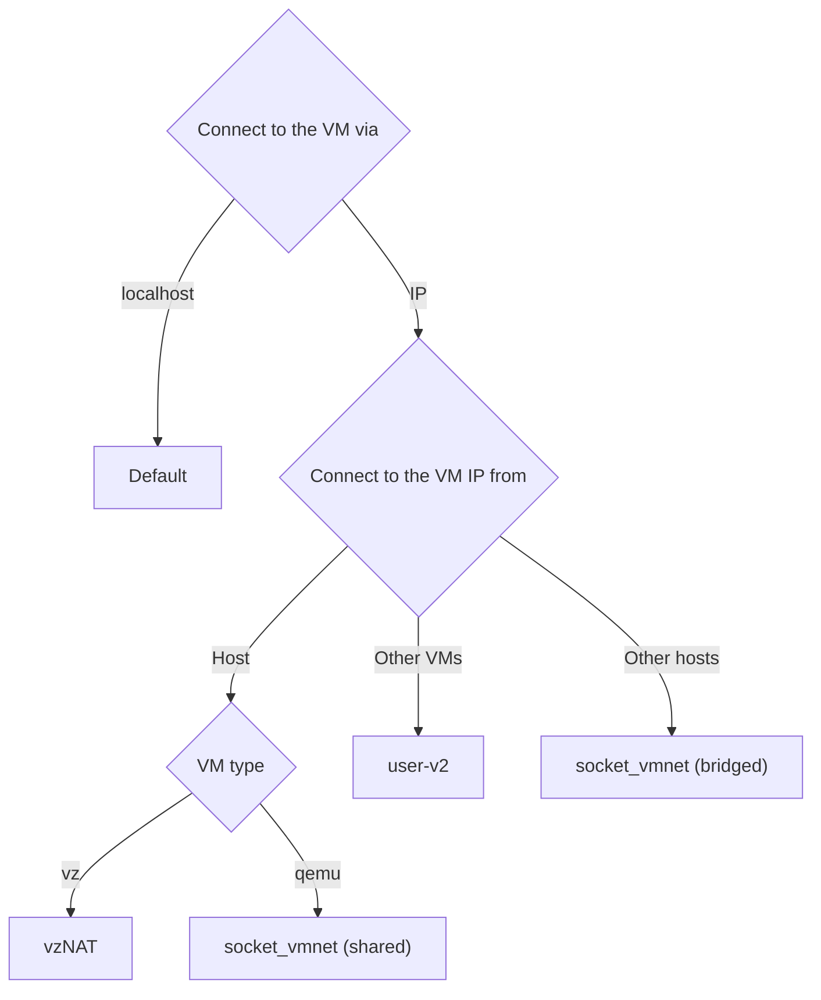

See the following flowchart to choose the best network for you:

## Default user-mode network (192.168.5.0/24)

By default Lima only enables the user-mode networking aka "slirp".

### Guest IP (192.168.5.15)

The guest IP address is set to `192.168.5.15`.

This IP address is not accessible from the host by design.

Use VMNet (see below) to allow accessing the guest IP from the host and other guests.

### Host IP (192.168.5.2)

The loopback addresses of the host is `192.168.5.2` and is accessible from the guest as `host.lima.internal`.

### DNS (192.168.5.3)

The DNS.

If `hostResolver.enabled` in `lima.yaml` is true, then the hostagent is going to run a DNS server over tcp and udp - each on a separate randomly selected free port. This server does a local lookup using the native host resolver, so it will deal correctly with VPN configurations and split-DNS setups, as well as mDNS, local `/etc/hosts` etc. For this the hostagent has to be compiled with `CGO_ENABLED=1` as default Go resolver is [broken](https://github.com/golang/go/issues/12524).

These tcp and udp ports are then forwarded via iptables rules to `192.168.5.3:53`, overriding the DNS provided by QEMU via slirp.

Currently following request types are supported:

- A
- AAAA
- CNAME
- TXT
- NS
- MX
- SRV

For all other queries hostagent will redirect the query to the nameservers specified in `/etc/resolv.conf` (or, if that fails - to `8.8.8.8` and `1.1.1.1`).

DNS over tcp is rarely used. It is usually only used either when user explicitly requires it, or when request+response can't fit into a single UDP packet (most likely in case of DNSSEC), or in the case of certain management operations such as domain transfers. Neither DNSSEC nor management operations are currently supported by a hostagent, but on the off chance that the response may contain an unusually long list of records - hostagent will also listen for the tcp traffic.

During initial cloud-init bootstrap, `iptables` may not yet be installed. In that case the repo server is determined using the slirp DNS. After `iptables` has been installed, the forwarding rule is applied, switching over to the hostagent DNS.

If `hostResolver.enabled` is false, then DNS servers can be configured manually in `lima.yaml` via the `dns` setting. If that list is empty, then Lima will either use the slirp DNS (on Linux), or the nameservers from the first host interface in service order that has an assigned IPv4 address (on macOS).

## Connecting to the VM IP

To choose the best network for you, you have 3 ways:
 - <b>VMNet networks</b> - for host-to-guest
 - <b>user-v2 network</b> - for guest-to-guest
 - <b>socket_vmnet(bridged) network</b> - for other-host-to-guest
