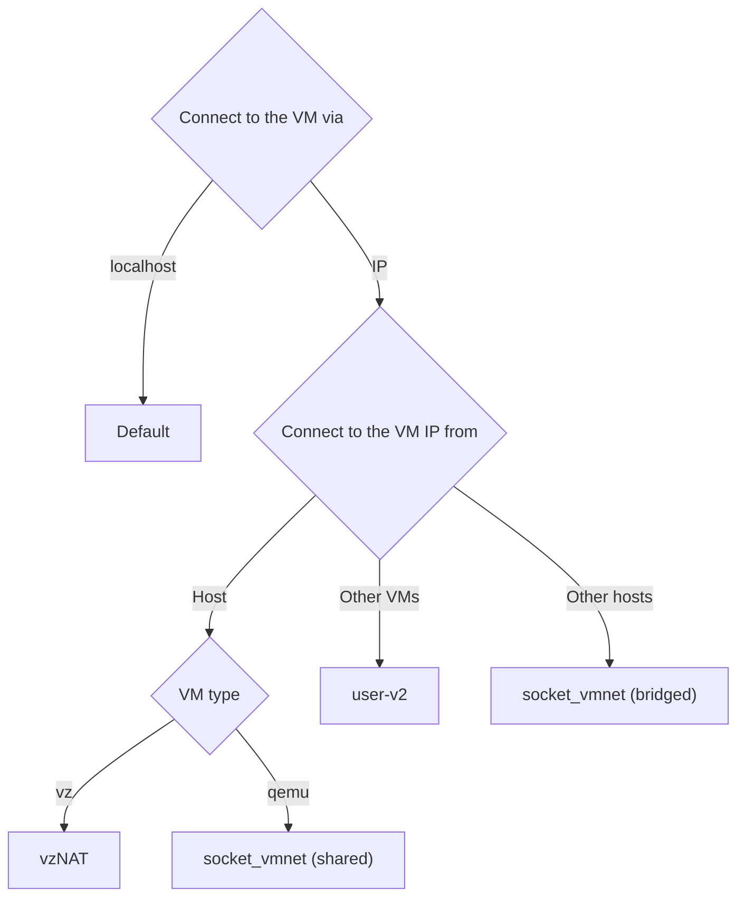

See the following flowchart to choose the best network for you:


## Default user-mode network (192.168.5.0/24)

By default Lima only enables the user-mode networking aka "slirp".

### Guest IP (192.168.5.15)

The guest IP address is set to `192.168.5.15`.

This IP address is not accessible from the host by design.

Use VMNet (see below) to allow accessing the guest IP from the host and other guests.

### Host IP (192.168.5.2)

The loopback addresses of the host is `192.168.5.2` and is accessible from the guest as `host.lima.internal`.

### DNS (192.168.5.3)

If `hostResolver.enabled` in `lima.yaml` is true, then the hostagent is going to run a DNS server over tcp and udp - each on a separate randomly selected free port. This server does a local lookup using the native host resolver, so it will deal correctly with VPN configurations and split-DNS setups, as well as mDNS, local `/etc/hosts` etc. For this the hostagent has to be compiled with `CGO_ENABLED=1` as default Go resolver is [broken](https://github.com/golang/go/issues/12524).

These tcp and udp ports are then forwarded via iptables rules to `192.168.5.3:53`, overriding the DNS provided by QEMU via slirp.

Currently following request types are supported:

- A
- AAAA
- CNAME
- TXT
- NS
- MX
- SRV

For all other queries hostagent will redirect the query to the nameservers specified in `/etc/resolv.conf` (or, if that fails - to `8.8.8.8` and `1.1.1.1`).

DNS over tcp is rarely used. It is usually only used either when user explicitly requires it, or when request+response can't fit into a single UDP packet (most likely in case of DNSSEC), or in the case of certain management operations such as domain transfers. Neither DNSSEC nor management operations are currently supported by a hostagent, but on the off chance that the response may contain an unusually long list of records - hostagent will also listen for the tcp traffic.

During initial cloud-init bootstrap, `iptables` may not yet be installed. In that case the repo server is determined using the slirp DNS. After `iptables` has been installed, the forwarding rule is applied, switching over to the hostagent DNS.

If `hostResolver.enabled` is false, then DNS servers can be configured manually in `lima.yaml` via the `dns` setting. If that list is empty, then Lima will either use the slirp DNS (on Linux), or the nameservers from the first host interface in service order that has an assigned IPv4 address (on macOS).

## Lima user-v2 network

| ⚡ Requirement | Lima >= 0.16.0 |
|-------------------|----------------|

user-v2 network provides a user-mode networking similar to the [default user-mode network](#user-mode-network--1921685024-) and also provides support for `vm -> vm` communication.

To enable this network mode, define a network with `mode: user-v2` in networks.yaml

By default, the below network configuration is already applied (Since v0.18).

```yaml
...
networks:
  user-v2:
    mode: user-v2
    gateway: 192.168.104.1
    netmask: 255.255.255.0
...
```

Instances can then reference these networks from their `lima.yaml` file:


{}
```bash
limactl start --network=lima:user-v2
```
{}
{}
```yaml
networks:
   - lima: user-v2
```
{}


An instance's IP address is resolvable from another instance as `lima-<NAME>.internal.` (e.g., `lima-default.internal.`).

_Note_

- Enabling this network will disable the [default user-mode network](#user-mode-network--1921685024-)

## VMNet networks

VMNet assigns a "real" IP address that is reachable from the host.

The configuration steps are different for each network type:
- [vzNAT](#vzNAT)
- [socket_vmnet](#socket_vmnet)

### vzNAT

| ⚡ Requirement | Lima >= 0.14, macOS >= 13.0 |
|-------------------|-----------------------------|

For [VZ](../vmtype/#vz) instances, the "vzNAT" network can be configured as follows:

{}
```bash
limactl start --vm-type=vz --network=vzNAT
```
{}
{}
```yaml
networks:
- vzNAT: true
```
{}


The range of the IP address is not specifiable.

The "vzNAT" network does not need the `socket_vmnet` binary and the `sudoers` file.

### socket_vmnet
#### Managed (192.168.105.0/24)

[`socket_vmnet`](https://github.com/lima-vm/socket_vmnet) can be used for adding another guest IP that is accessible from the host and other guests,
without depending on vz.
It must be installed according to the instruction provided on https://github.com/lima-vm/socket_vmnet.

Note that installation using Homebrew is not secure and not recommended by the Lima project.
Homebrew installation will only work with Lima if password-less `sudo` is enabled for the current user.
The `limactl sudoers` command requires that `socket_vmnet` is installed into a secure path only
writable by `root` and will reject `socket_vmnet` installed by Homebrew into a user-writable location.

```bash
# Install socket_vmnet as root from source to /opt/socket_vmnet
# using instructions on https://github.com/lima-vm/socket_vmnet
# This assumes that Xcode Command Line Tools are already installed
git clone https://github.com/lima-vm/socket_vmnet
cd socket_vmnet
# Change "v1.1.5" to the actual latest release in https://github.com/lima-vm/socket_vmnet/releases
git checkout v1.1.5
make
sudo make PREFIX=/opt/socket_vmnet install.bin

# Set up the sudoers file for launching socket_vmnet from Lima
limactl sudoers >etc_sudoers.d_lima
less etc_sudoers.d_lima  # verify that the file looks correct
sudo install -o root etc_sudoers.d_lima /etc/sudoers.d/lima
rm etc_sudoers.d_lima
```

> **Note**
>
> Lima before v0.12 used `vde_vmnet` for managing the networks.
> `vde_vmnet` is no longer supported.
>
> Lima v0.14.0 and later used to also accept `socket_vmnet` installations if they were
> owned by the `admin` user. Starting with v1.0.0 only `root` ownership is acceptable.

The networks are defined in `$LIMA_HOME/_config/networks.yaml`. If this file doesn't already exist, it will be created with these default
settings:

<details>
<summary>Default</summary>

<p>

```yaml
# Path to socket_vmnet executable. Because socket_vmnet is invoked via sudo it should be
# installed where only root can modify/replace it. This means also none of the
# parent directories should be writable by the user.
#
# The varRun directory also must not be writable by the user because it will
# include the socket_vmnet pid file. Those will be terminated via sudo, so replacing
# the pid file would allow killing of arbitrary privileged processes. varRun
# however MUST be writable by the daemon user.
#
# None of the paths segments may be symlinks, why it has to be /private/var
# instead of /var etc.
paths:
# socketVMNet requires Lima >= 0.12 .
  socketVMNet: /opt/socket_vmnet/bin/socket_vmnet
  varRun: /private/var/run/lima
  sudoers: /private/etc/sudoers.d/lima

group: everyone

networks:
  shared:
    mode: shared
    gateway: 192.168.105.1
    dhcpEnd: 192.168.105.254
    netmask: 255.255.255.0
  bridged:
    mode: bridged
    interface: en0
    # bridged mode doesn't have a gateway; dhcp is managed by outside network
  host:
    mode: host
    gateway: 192.168.106.1
    dhcpEnd: 192.168.106.254
    netmask: 255.255.255.0
```

</p>

</details>

Instances can then reference these networks:


{}
```bash
limactl start --network=lima:shared
```
{}
{}
```yaml
networks:
  # Lima can manage the socket_vmnet daemon for networks defined in $LIMA_HOME/_config/networks.yaml automatically.
  # The socket_vmnet binary must be installed into a secure location only alterable by the "root" user.
  # - lima: shared
  #   # MAC address of the instance; lima will pick one based on the instance name,
  #   # so DHCP assigned ip addresses should remain constant over instance restarts.
  #   macAddress: ""
  #   # Interface name, defaults to "lima0", "lima1", etc.
  #   interface: ""
```
{}


The network daemon is started automatically when the first instance referencing them is started,
and will stop automatically once the last instance has stopped. Daemon logs will be stored in the
`$LIMA_HOME/_networks` directory.

Since the commands to start and stop the `socket_vmnet` daemon requires root, the user either must
have password-less `sudo` enabled, or add the required commands to a `sudoers` file. This can
be done via:

```shell
limactl sudoers >etc_sudoers.d_lima
less etc_sudoers.d_lima  # verify that the file looks correct
sudo install -o root etc_sudoers.d_lima /etc/sudoers.d/lima
rm etc_sudoers.d_lima
```

The IP address is automatically assigned by macOS's bootpd.
If the IP address is not assigned, try the following commands:
```bash
sudo /usr/libexec/ApplicationFirewall/socketfilterfw --add /usr/libexec/bootpd
sudo /usr/libexec/ApplicationFirewall/socketfilterfw --unblock /usr/libexec/bootpd
```

#### Unmanaged
Lima can also connect to "unmanaged" networks addressed by "socket". This
means that the daemons will not be controlled by Lima, but must be started
before the instance.  The interface type (host, shared, or bridged) is
configured in `socket_vmnet` and not in lima.

```yaml
networks:
  - socket: "/var/run/socket_vmnet"
```
