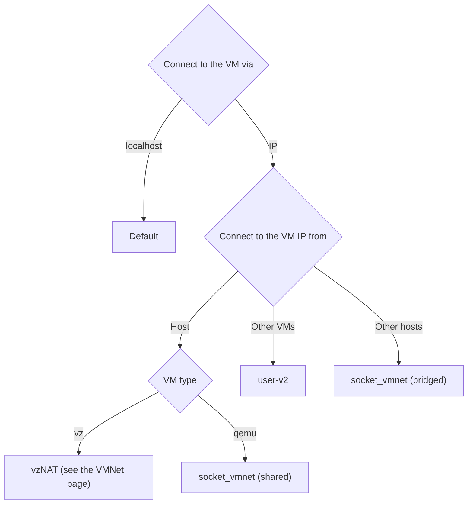

See the following flowchart to choose the best network for you:


## Managing named networks (limactl network)

Lima networks defined in `~/.lima/_config/networks.yaml` provide named
interfaces that can be shared across instances.

### Listing networks

```sh
limactl network list
# or the short alias:
limactl network ls
# machine-readable output:
limactl network list --json
```

### Creating a network

```sh
limactl network create NAME --gateway CIDR
```

Example:

```sh
limactl network create mynet --gateway 192.168.42.1/24
```

### Attaching a network to an instance

Add the network name under the `networks` key before starting the instance:

```yaml
networks:
  - lima: mynet
```

### Deleting a network

```sh
limactl network delete --force NAME [NAME...]
```

> **Note:** `--force` is currently required.
