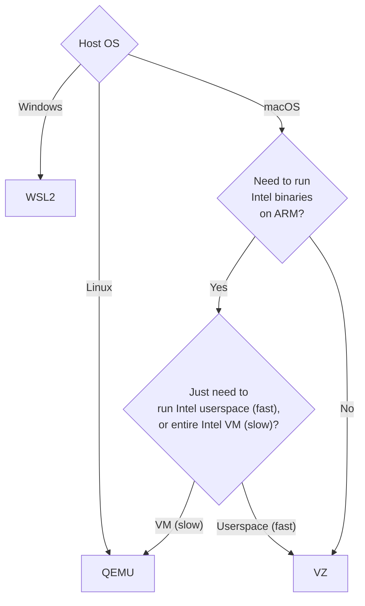

Lima supports two ways of running guest machines:
- [qemu](#qemu)
- [vz](#vz)

The vmType can be specified only on creating the instance.
The vmType of existing instances cannot be changed.

See the following flowchart to choose the best vmType for you:


## QEMU
"qemu" option makes use of QEMU to run guest operating system. 
This option is used by default if "vmType" is not set.

## VZ
> **Warning**
> "vz" mode is experimental (will graduate from experimental in Lima v1.0)

| ⚡ Requirement | Lima >= 0.14, macOS >= 13.0 |
|-------------------|-----------------------------|

"vz" option makes use of native virtualization support provided by macOS Virtualization.Framework.

An example configuration:

{}
```bash
limactl start --vm-type=vz --mount-type=virtiofs
```
{}
{}
```yaml
# Example to run ubuntu using vmType: vz instead of qemu (Default)
vmType: "vz"
images:
- location: "https://cloud-images.ubuntu.com/releases/24.04/release/ubuntu-24.04-server-cloudimg-amd64.img"
  arch: "x86_64"
- location: "https://cloud-images.ubuntu.com/releases/24.04/release/ubuntu-24.04-server-cloudimg-arm64.img"
  arch: "aarch64"
mounts:
  - location: "~"
mountType: "virtiofs"
```
{}

### Caveats
- "vz" option is only supported on macOS 13 or above
- Virtualization.framework doesn't support running "intel guest on arm" and vice versa

### Known Issues
- "vz" doesn't support `legacyBIOS: true` option, so guest machine like centos-stream, archlinux, oraclelinux will not work
- When running lima using "vz", `${LIMA_HOME}/<INSTANCE>/serial.log` will not contain kernel boot logs
- On Intel Mac with macOS prior to 13.5, Linux kernel v6.2 (used by Ubuntu 23.04, Fedora 38, etc.) is known to be unbootable on vz.
  kernel v6.3 and later should boot, as long as it is booted via GRUB.
  https://github.com/lima-vm/lima/issues/1577#issuecomment-1565625668
  The issue is fixed in macOS 13.5.

## WSL2
> **Warning**
> "wsl2" mode is experimental

| ⚡ Requirement | Lima >= 0.18 + (Windows >= 10 Build 19041 OR Windows 11) |
| ----------------- | -------------------------------------------------------- |

"wsl2" option makes use of native virtualization support provided by Windows' `wsl.exe` ([more info](https://learn.microsoft.com/en-us/windows/wsl/about)).

An example configuration:

{}
```bash
limactl start --vm-type=wsl2 --mount-type=wsl2 --containerd=system
```
{}
{}
```yaml
# Example to run Fedora using vmType: wsl2
vmType: wsl2
images:
# Source: https://github.com/runfinch/finch-core/blob/main/Dockerfile
- location: "https://deps.runfinch.com/common/x86-64/finch-rootfs-production-amd64-1690920103.tar.zst"
  arch: "x86_64"
  digest: "sha256:53f2e329b8da0f6a25e025d1f6cc262ae228402ba615ad095739b2f0ec6babc9"
mountType: wsl2 
containerd:
  system: true
  user: false
```
{}


### Caveats
- "wsl2" option is only supported on newer versions of Windows (roughly anything since 2019)

### Known Issues
- "wsl2" currently doesn't support many of Lima's options. See [this file](https://github.com/lima-vm/lima/blob/master/pkg/wsl2/wsl_driver_windows.go#L19) for the latest supported options.
- When running lima using "wsl2", `${LIMA_HOME}/<INSTANCE>/serial.log` will not contain kernel boot logs
- WSL2 requires a `tar` formatted rootfs archive instead of a VM image
- Windows doesn't ship with ssh.exe, gzip.exe, etc. which are used by Lima at various points. The easiest way around this is to run `winget install -e --id Git.MinGit` (winget is now built in to Windows as well), and add the resulting `C:\Program Files\Git\usr\bin\` directory to your path.
